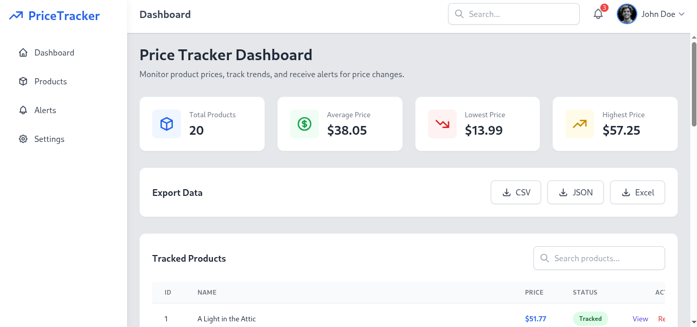
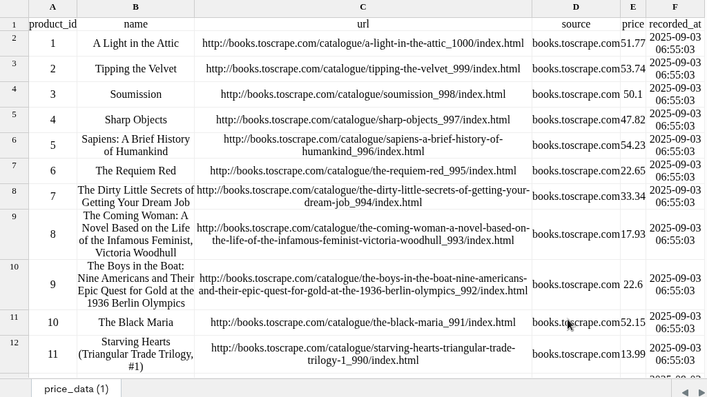

E-commerce Price Tracker & Alerts

An automation tool that tracks product prices from e-commerce websites, stores the history, and sends instant alerts when prices change. Designed to save time, reduce manual work, and help businesses make smarter pricing decisions.

Features

* 🔄 Automated daily scraping of product prices
* 📂 Stores price history in SQLite database
* 📊 Dashboard with price trend charts
* 📑 Exports data to CSV/Excel for reporting

 🛠️ Tech Stack

* **Python** (BeautifulSoup / Requests / Playwright)
* **SQLite + Pandas** (data storage & analysis)
* **Flask + Chart.js** (dashboard visualization)
* **Telegram Bot API** (alerts & notifications)

 How It Works

1. Add product URLs to the tracker.
2. Script scrapes product prices on schedule (daily/hourly).
3. Data is stored in a database and plotted in the dashboard.
4. Alerts are sent when prices drop or meet conditions.

📸 Demo Screenshots  

Dashboard with Price Trends  
  

Example CSV Export  
  

Example Use Case

👉 A business wants to monitor competitor prices for the same product across multiple websites.

* Without automation → They spend hours manually checking.
* With this tool → They get real-time alerts and a dashboard, saving **90% of their time**.

